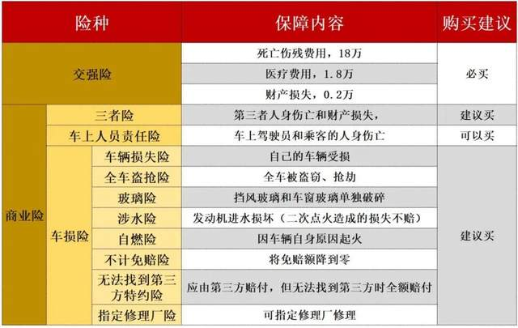
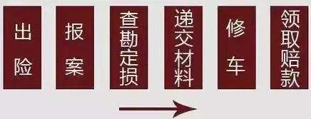

车险主要分为两大类：
1. 交强险（国家强制购买）
2. 商业险

## 交强险
交强险，全称是“机动车交通事故责任强制保险”，说白了，就是国家强制购买的一种车险。
如果不买交强险就上路行驶，是一种违法行为，而且你也没法给自己的新车上户、也过不了年检，被交警查到了还会被扣押、罚款。

交强险虽然定价良心，但有两个致命缺点：
1. 交强险的赔付对象是第三者的人身伤亡和财产损失，赔付对象仅限于第三者。
如果自己的车撞坏了，或是自己车上的人受伤了，对不起，交强险是不赔的。
2. 交强险的保额非常低。在同一次保险事故中，交强险赔付第三者财产损失最多只有2000元，超出部分只能由车主自行承担（如果车主购买了商业险中的第三者责任险的话，超出部分就由商业保险公司承担）。如果是把人撞伤了，医药费最多赔1.8万元，如果不幸把人撞死或撞残了，交强险最多赔偿18万的死亡伤残赔偿金。0.2+1.8+18，交强险总保额加起来，也只有可怜的20万。商业险里有一个第三者责任险，它就是对交强险的直接补充，交强险赔付额度不够的部分，直接由商业险赔付。

## 商业险
商业险主要有第三者责任险、车上人员险和车损险。
1. 第三者责任险
	这个肯定是要买的，额度最低也要买 `100`万。
2. 车上人员险
	这里指的是给驾驶员和车上人员的保险，俗称“座位险”。相当于一份跟车不跟人的意外险，不管是谁，只要乘坐我们车发生意外，都有保障。讲真，有点鸡肋，因为座位险保额普遍较低，价格偏贵，不推荐。如果真担心发生交通意外，可以单独给自己或经常坐车的家人配置意外险。只有一种情况除外，你的私家车经常要跑滴滴。车上不断有乘客，而且乘客身份不确定，那买一份“座位险”，能在发生严重交通事故时，分担自身赔偿责任。
3. 车损险
	出了事故，给对方的赔偿有交强险和三责险基本够了，但如果不是对方全责，自己车子的维修费还要自掏腰包，严重的事故，可能修一次车就要大几万。车险改革前，车损险是坑人的重灾区，附加险一大堆，什么玻璃险、划痕险、涉水险、自燃险、不计免赔险等等，看得人眼花缭乱，不知所措。真到理赔时，才发现，自己没买对应的附加险，保险公司拒赔。所以民间常有吐槽：保险就两个不赔，这也不赔，那也不赔……。有些人觉得车险水太深，干脆不买，让行车暴露在巨大风险之下。但去年改革后，车损险焕然一新了！大部分跟车损相关的险种，全部打包在一起，要就一起全要，不要就一起全不要，没得选！

	看到这里，有些小伙伴可能有点懵，看下面这张表，一目了然——
	

## 怎么买最便宜
看到这里，什么保险该买，什么不该买，相信大家应该有了清晰的认识，那怎么买最便宜呢？

我们得先了解，车险费用的计算方式。

如果车型、车龄、险种、保额这些基本要素确定，那车险的标准价格就是固定的。

因为车险是个被严监管的市场，不允许保险公司自己定价，全部由保监会制定，所有保险公司一律按照这套价格体系执行。

那为啥我们在不同保险公司或车险平台买的车险价格会有差异呢？

主要是折扣力度不同。

现在投保渠道很多，比如个销渠道、电销渠道、4S店等等。

一般情况下，如果你买车险综合实力TOP3的保险公司（人保、平安、太平洋），无论你在什么渠道购买，保费都相差不大，主要是赠品价值差异。

比如A渠道送购物卡，B渠道送洗车、小保养、喷漆、代驾、机场停车等，C渠道送贴膜，D渠道再加送小家电……

力哥的经验是，电销渠道折扣往往更大，4S店则相对较小。

而且同一家保险公司，不同电销渠道给出的促销方案，也会有轻微差异。

如果是其他保险公司，价格战可能会打得更明显一点，乍一看更划算。

但力哥建议不要贪这个便宜，优选上面提到的三大车险公司。

因为车险和人身险不同，一是理赔概率高得多，二是一旦发生事故，很多人会急成热锅上的蚂蚁，第一时间的服务特别重要，大保险公司网点覆盖更密，道路救援更及时，理赔服务更周到。

还有一点要注意，连续一段时间不出险，车险费率会有很大折扣。

反之，出险次数多的话，不仅没折扣，次年保费还会上浮。

具体来说，连续三年没发生商业赔款，基础保费打6折；

连续两年没发生商业赔款，基础保费打7折；

上一年没发生商业赔款，基础保费打85折；

新车上险或上年发生1次商业赔款，不打折；

上年发生2次商业赔款，保费上浮25%；

上年发生3次商业赔款，保费上浮50%；

上年发生4次商业赔款，保费上浮75%；

上年发生5次商业赔款以上，商业险翻倍或者可能拒保。

怎么样，还算公平吧？

当然，按世界首富马诗客的说法，这种算法依然不公平。

一年只开几次，和每天都上路的车，发生交通事故的概率有天壤之别，确定保费时，还应考虑汽车行驶时间。

路上多开一分钟，就该多付一分钱保费，全年停车库里的车，就不该交保费。

所以马诗客准备自己做车险，给特斯拉车主提供更公平合理的车险服务，我们拭目以待~

目前车险市场上，保费最低不只打6折，考虑到是否有违章、渠道成本等因素，连续三年不出险的客户，最低可以打到4.3折。

以上描述都是针对商业险，交强险没任何猫腻，也没任何省钱攻略，闭着眼睛买就行，该赔多少赔多少，反正有国家撑腰~

报案理赔流程

最后说下理赔流程。

保险公司标准理赔流程是：报案——定损——修车——理赔。

顺！序！千！万！不！能！乱！

车险理赔流程

出了交通事故，千万别拖，一定要第一时间给保险公司打电话报案，超过48小时不报案，保险公司是可以不予赔付的！

各保险公司出险报案电话不一样，平安是95511、太平洋是95500，人保是95518，都很好记。

一般情况下，保险公司会要求你先报案，让警方留下记录，涉及到第三方的事故，需要警方出具事故责任认定书。

报案之后，保险公司会派人查勘现场，照相，然后把车开到维修单位去确定损失，定损需要有保险公司、修理厂（4S店）及客户三方共同参与。修理厂（4S店）会根据车损情况，给一个修理方案。

方案包括哪些配件要换，哪些配件要修，材料费多少钱，人工费多少钱，由保险公司的专业定损人员确定无误后，给出一个维修总金额，这个金额就是保险公司的赔付金额。

如果你为了图省事，还没通知保险公司，就先开到附近或熟悉的修理厂修车，等保险公司介入后，搞不清你到底修了多少钱，你说修了5000元，保险公司说不对，报价太高了，3000元就能修好，到时就扯不清了……

日常行车过程中，发生重大事故的概率比较小，更容易发生的是轻微事故，人没撞伤，车子也只是轻微擦伤。

这种情况可以启动快速（简易）理赔流程，不用约好时间一起去交警大队或修理厂，理赔员现场拍照取证后，直接和你约定一个理赔额，自己有空再去修，去哪里修也随你。

如果你觉得车子划了一道痕无所谓，这钱拿去吃吃喝喝也可以~

还有个小秘诀送给大家，如果定损金额产生差价，有两种解决方案：一是投诉到12378保监局；二是起诉保险公司，前一种最省力有效。

再比如定损过程中，你想直接更换某个配件，但保险公司只肯出维修的钱，投诉到12378，一般也能解决。

总之，凡事遇到和保险公司协商不好的事，觉得自己受委屈了，第一选择是打12378。

我们是社会主义国家，特别讲究公平正义和对弱势群体的保护，和保险公司相比，投保人相对弱势，在合法合理前提下，保监会一般会更倾向保护投保人。